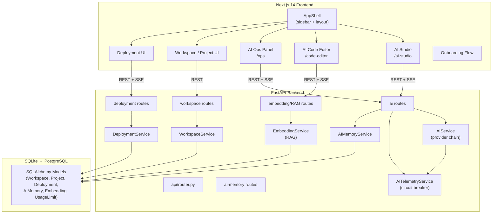
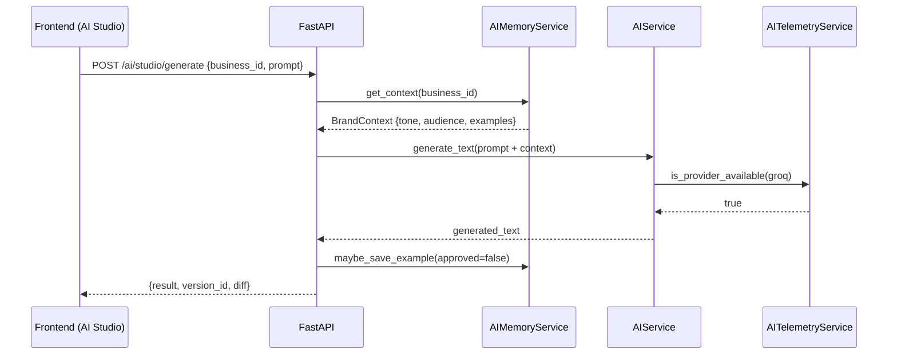
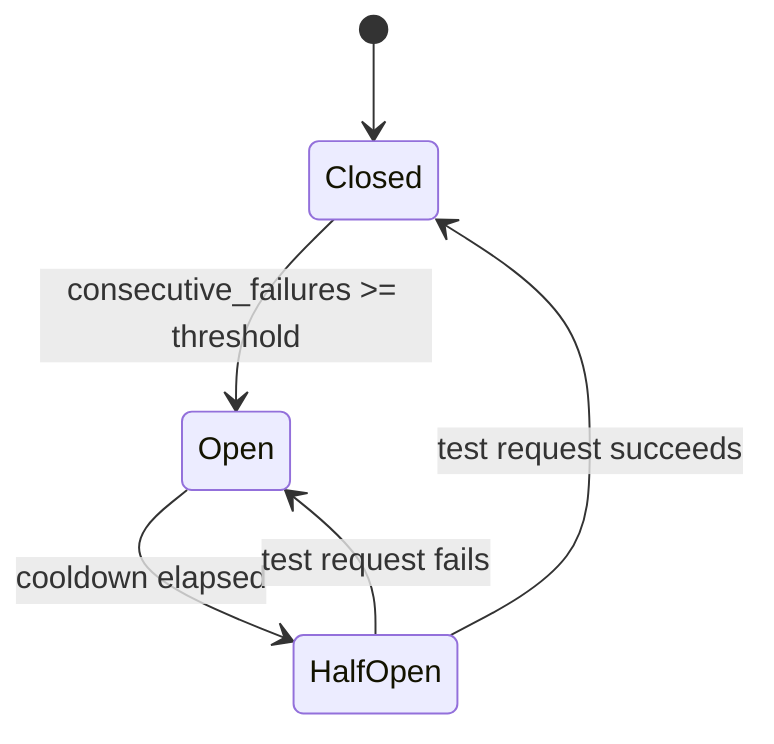

# Design Document — Platform Evolution

## Overview

This document describes the technical design for evolving the AI-powered SaaS platform into a world-class AI-native operating system. The platform is built on **FastAPI** (Python 3.11+) for the backend and **Next.js 14** (App Router, TypeScript) for the frontend.

The evolution spans thirteen requirement areas: sidebar restructure, AI Studio rename and premium experience, AI memory, advanced AI Code Editor, AI Ops observability, workspace/project system, deployment system, product polish, onboarding, monetisation tiers, AI provider reliability, and accessibility foundations.

The design follows these guiding principles:
- **Additive over destructive** — new routes, models, and components are added alongside existing ones; breaking changes are minimised.
- **Incremental delivery** — each requirement area can be shipped independently.
- **Existing patterns first** — new code follows the conventions already established in `ai_service.py`, `ai_telemetry.py`, and the AppShell component.

---

## Architecture

### High-Level System Diagram



### Request Flow — AI Generation with Memory



### Circuit Breaker State Machine



---

## Components and Interfaces

### 1. AppShell — Sidebar Restructure

**File:** `frontend/components/AppShell.tsx`

The existing flat `NAV` array is replaced with a structured group definition. The three section keys (`business`, `developer`, `system`) map to labelled groups.

```typescript
type NavGroup = {
  key: string;
  label: string;
  items: NavItem[];
};

const NAV_GROUPS: NavGroup[] = [
  {
    key: "business",
    label: "Business Tools",
    items: [
      { href: "/dashboard",   label: "Dashboard",       icon: LayoutDashboard },
      { href: "/ai-studio",   label: "AI Studio",       icon: Sparkles },
      { href: "/marketing",   label: "Marketing Engine", icon: TrendingUp },
      { href: "/products",    label: "Products",         icon: Boxes },
      { href: "/analytics",   label: "Analytics",        icon: BarChart3 },
      { href: "/support",     label: "Support",          icon: MessageCircle },
    ],
  },
  {
    key: "developer",
    label: "Developer Tools",
    items: [
      { href: "/code-editor", label: "AI Code Editor",  icon: Terminal },
      { href: "/agent-live",  label: "Agent Live",       icon: Activity },
      { href: "/ops",         label: "AI Ops",           icon: Shield },
    ],
  },
  {
    key: "system",
    label: "System",
    items: [
      { href: "/settings",    label: "Settings",         icon: Settings },
    ],
  },
];
```

The `WorkspaceSwitcher` component is inserted above the nav groups in the sidebar, rendering the current workspace name and a dropdown to switch.

### 2. AI Studio — Route and Page

**Files:**
- `frontend/app/ai-studio/page.tsx` (new)
- `frontend/app/ai-playground/page.tsx` → redirect to `/ai-studio`

The AI Studio page uses a three-panel layout:

```
┌─────────────────────────────────────────────────────────────┐
│  Top bar: business selector | Deploy button | Undo          │
├──────────────────┬──────────────────────┬───────────────────┤
│  Left Panel      │  Centre Panel        │  Right Panel      │
│  Prompt input    │  Live preview        │  Version history  │
│  Brand context   │  (iframe / render)   │  Diff cards       │
│  Suggestions     │  Progress indicator  │  Restore actions  │
└──────────────────┴──────────────────────┴───────────────────┘
```

**Key React state:**
```typescript
type StudioState = {
  businessId: string | null;
  conversationHistory: Message[];
  currentVersion: VersionEntry | null;
  versions: VersionEntry[];
  brandContext: BrandContext | null;
  generationStage: GenerationStage | null; // null = idle
};

type GenerationStage =
  | "planning"
  | "generating"
  | "applying"
  | "rendering"
  | "complete";
```

### 3. AI Memory Service

**File:** `backend/app/services/ai_memory_service.py` (new)

```python
class AIMemoryService:
    async def get_context(self, business_id: str, user_id: str) -> BrandContext | None: ...
    async def save_context(self, business_id: str, user_id: str, ctx: BrandContext) -> None: ...
    async def append_example(self, business_id: str, content: str) -> None: ...
    async def inject_into_prompt(self, prompt: str, ctx: BrandContext) -> str: ...
```

**Route:** `POST /ai/memory/{business_id}`, `GET /ai/memory/{business_id}`

### 4. AI Code Editor — Enhanced

**File:** `frontend/app/code-editor/page.tsx` (extended)

New panels added to the existing three-column layout:

- **Multi-file tabs**: tab bar above the editor, one tab per open file, unsaved indicator dot
- **Agent Plan panel**: slides in from the right when an agent task is queued, shows step list with approve/cancel
- **Inline Cmd+K**: floating prompt input anchored to cursor position via `getBoundingClientRect`

**RAG integration** — new backend service:

```python
class EmbeddingService:
    async def index_workspace(self, workspace_id: str) -> IndexStats: ...
    async def search(self, workspace_id: str, query: str, top_k: int = 5) -> list[CodeChunk]: ...
    async def chunk_file(self, path: str, content: str) -> list[CodeChunk]: ...
```

Embeddings are stored in the `code_embeddings` table (see Data Models). The frontend sends the current instruction to `POST /code-editor/search` before the AI edit call, receiving top-N chunks that are prepended to the AI context.

### 5. AI Ops Panel — Enhanced

**File:** `frontend/app/ops/page.tsx` (extended)

New sections added below the existing provider cards and failure log:

| Section | Data source |
|---|---|
| Token usage chart | `GET /ai/telemetry/tokens?window=24h` |
| Latency percentile chart (p50/p95/p99) | `GET /ai/telemetry/latency?window=24h` |
| Agent execution graph | `GET /agents/executions/latest` |
| Fallback history log | `GET /ai/telemetry/fallbacks` |
| Live SSE events panel | `GET /ai/telemetry/stream` (SSE) |
| Model routing logic | `GET /ai/telemetry/routing` |
| Circuit breaker reset | `POST /ai/telemetry/reset/{provider}` |

Charts use **Recharts** (already a common Next.js dependency) — `LineChart` for token usage and latency percentiles, `Graph` (custom SVG) for agent execution.

### 6. Workspace and Project System

**Backend services:**
- `WorkspaceService` — CRUD for Workspace, member invite, role enforcement
- `ProjectService` — CRUD for Project, template instantiation, env var management

**Frontend components:**
- `WorkspaceSwitcher` — dropdown in sidebar header
- `ProjectOverview` — page at `/workspace/[slug]/project/[id]`
- `EnvVarEditor` — masked input table for environment variables

**Role enforcement middleware:**

```python
async def require_role(
    min_role: Role,
    workspace_id: str,
    current_user: User,
    db: AsyncSession,
) -> WorkspaceMember: ...
```

Viewer write attempts return HTTP 403 with `{"detail": "Insufficient permissions: Viewer role cannot perform write actions"}`.

### 7. Deployment System

**Backend service:** `DeploymentService`

```python
class DeploymentService:
    async def create_preview(self, project_id: str, user_id: str) -> Deployment: ...
    async def promote_to_production(self, deployment_id: str) -> Deployment: ...
    async def rollback(self, project_id: str, target_deployment_id: str) -> Deployment: ...
    async def run_ai_checks(self, deployment_id: str) -> list[DeploymentCheck]: ...
    async def stream_build_log(self, deployment_id: str) -> AsyncIterator[str]: ...
```

**Routes:** `POST /deployments/preview`, `POST /deployments/{id}/promote`, `POST /deployments/{id}/rollback`, `GET /deployments/{id}/log` (SSE)

**Frontend:** `/deploy/[project_id]` page with deployment history table, build log terminal, and AI checks checklist.

### 8. Monetisation — Feature Gates

**File:** `backend/app/services/usage_limit_service.py` (extended)

The existing `UsageLimitService` is extended with a `check_feature_gate` method:

```python
async def check_feature_gate(
    self,
    user_id: str,
    feature: GatedFeature,
    db: AsyncSession,
) -> GateResult: ...

class GatedFeature(str, Enum):
    AI_STUDIO_MULTI_STEP = "ai_studio_multi_step"
    CODE_EDITOR_RAG = "code_editor_rag"
    DEPLOYMENT_SYSTEM = "deployment_system"
    WORKSPACE_TEAM = "workspace_team"
```

Frontend: `useFeatureGate(feature)` hook returns `{ allowed: bool, tier: Tier }`. When `allowed=false`, the `FeatureGateModal` component is rendered.

### 9. Onboarding Flow

**Frontend:** `OnboardingChecklist` component rendered as a floating card on the dashboard when `user.onboarding_complete = false`.

**Backend:** `OnboardingService` tracks step completion, triggers welcome email via `EmailService`.

### 10. Design Token System

**File:** `frontend/app/globals.css` (extended)

CSS custom properties define the token system:

```css
:root {
  /* Colours */
  --color-primary: #6366f1;
  --color-primary-hover: #4f46e5;
  /* Typography */
  --text-page-title: 700 26px/1.2 var(--font-sans);
  --text-section-heading: 700 17px/1.3 var(--font-sans);
  /* Spacing */
  --space-card-padding: 20px 22px;
  /* Radii */
  --radius-card: 18px;
  --radius-button: 10px;
  /* Shadows */
  --shadow-card: 0 2px 12px rgba(0,0,0,0.04);
}
```

### 11. Accessibility

All new interactive elements use semantic HTML (`<button>`, `<a>`, `<input>`). Icon-only buttons receive `aria-label`. Focus rings use `outline: 2px solid var(--color-primary); outline-offset: 2px`. Logical CSS properties (`margin-inline`, `padding-inline`) are used in all new components.

---

## Data Models

### New SQLAlchemy Models

```python
# Workspace
class Workspace(Base):
    __tablename__ = "workspaces"
    id: Mapped[str]          # UUID
    name: Mapped[str]
    slug: Mapped[str]        # unique
    owner_id: Mapped[str]    # FK → users.id
    created_at: Mapped[datetime]

# WorkspaceMember
class WorkspaceMember(Base):
    __tablename__ = "workspace_members"
    workspace_id: Mapped[str]   # FK → workspaces.id
    user_id: Mapped[str]        # FK → users.id
    role: Mapped[str]           # "owner" | "editor" | "viewer"

# Project
class Project(Base):
    __tablename__ = "projects"
    id: Mapped[str]
    workspace_id: Mapped[str]   # FK → workspaces.id
    name: Mapped[str]
    type: Mapped[str]           # "business" | "codebase"
    template_id: Mapped[str | None]
    created_at: Mapped[datetime]
    updated_at: Mapped[datetime]

# Deployment
class Deployment(Base):
    __tablename__ = "deployments"
    id: Mapped[str]
    project_id: Mapped[str]     # FK → projects.id
    environment: Mapped[str]    # "preview" | "staging" | "production"
    status: Mapped[str]         # "pending"|"building"|"live"|"failed"|"rolled_back"
    preview_url: Mapped[str | None]
    triggered_by: Mapped[str]   # FK → users.id
    created_at: Mapped[datetime]

# DeploymentCheck
class DeploymentCheck(Base):
    __tablename__ = "deployment_checks"
    id: Mapped[str]
    deployment_id: Mapped[str]  # FK → deployments.id
    check_type: Mapped[str]     # "breaking_api"|"missing_env"|"security"
    status: Mapped[str]         # "pass"|"warn"|"fail"
    message: Mapped[str]

# AIMemory
class AIMemory(Base):
    __tablename__ = "ai_memory"
    id: Mapped[str]
    business_id: Mapped[str]    # FK → businesses.id
    user_id: Mapped[str]        # FK → users.id
    brand_name: Mapped[str]
    tone_of_voice: Mapped[str]
    target_audience: Mapped[str]
    key_differentiators: Mapped[str]   # JSON array
    approved_examples: Mapped[str]     # JSON array of content strings
    updated_at: Mapped[datetime]

# CodeEmbedding
class CodeEmbedding(Base):
    __tablename__ = "code_embeddings"
    id: Mapped[str]
    workspace_id: Mapped[str]
    file_path: Mapped[str]
    chunk_index: Mapped[int]
    content: Mapped[str]
    embedding: Mapped[bytes]    # serialised float32 vector
    updated_at: Mapped[datetime]

# VersionHistory (extends existing code_versions)
# No schema change needed — existing code_version model covers AI commit history.
# New fields added via migration:
#   instruction TEXT, diff_summary TEXT, agent_plan JSON
```

### Existing Models Extended

| Model | New fields |
|---|---|
| `User` | `subscription_tier` (str, default "free"), `onboarding_complete` (bool) |
| `UsageLimit` | `feature_gates` (JSON) |

### Alembic Migration Plan

| Migration | Description |
|---|---|
| `0009_workspaces_projects.py` | Workspace, WorkspaceMember, Project tables |
| `0010_deployments.py` | Deployment, DeploymentCheck tables |
| `0011_ai_memory.py` | AIMemory table |
| `0012_code_embeddings.py` | CodeEmbedding table |
| `0013_user_tier_onboarding.py` | Add tier + onboarding fields to User |

---

## Correctness Properties


### P1 — Sidebar groups are exhaustive and non-overlapping
Every authenticated route appears in exactly one NAV_GROUPS entry. No route appears in both Business Tools and Developer Tools.

### P2 — AI Studio route redirect is lossless
Any request to `/ai-playground` (with or without query params) is redirected to `/ai-studio` preserving query params. No 404 is returned.

### P3 — AI memory injection is idempotent
Calling `inject_into_prompt(prompt, ctx)` twice with the same inputs produces the same output. Memory context is prepended once, never duplicated.

### P4 — Circuit breaker state transitions are monotonic within a window
A provider's circuit state can only transition Closed→Open→HalfOpen→Closed. It cannot skip states or transition backwards except via the defined recovery path.

### P5 — Feature gate enforcement is consistent
`check_feature_gate(user_id, feature)` returns the same result for the same user and feature within a billing period, unless the user's tier changes.

### P6 — Deployment rollback is atomic
A rollback either fully restores the target deployment's state and marks it `live`, or fails entirely leaving the current production deployment unchanged.

### P7 — RAG search returns deterministic top-K
For the same query and workspace index state, `EmbeddingService.search()` returns the same top-K chunks in the same order.

---

## API Endpoints Summary

| Method | Path | Description |
|---|---|---|
| GET | `/ai/memory/{business_id}` | Get brand context for a business |
| POST | `/ai/memory/{business_id}` | Save/update brand context |
| POST | `/ai/studio/generate` | Generate business asset with memory injection |
| GET | `/ai/telemetry/tokens` | Token usage over time window |
| GET | `/ai/telemetry/latency` | Latency percentiles over time window |
| GET | `/ai/telemetry/fallbacks` | Fallback history log |
| GET | `/ai/telemetry/stream` | SSE stream of live telemetry events |
| GET | `/ai/telemetry/routing` | Current provider routing logic |
| POST | `/ai/telemetry/reset/{provider}` | Manually reset circuit breaker |
| GET | `/workspaces` | List user's workspaces |
| POST | `/workspaces` | Create workspace |
| GET | `/workspaces/{id}/members` | List workspace members |
| POST | `/workspaces/{id}/invite` | Invite member by email |
| GET | `/workspaces/{id}/projects` | List projects in workspace |
| POST | `/workspaces/{id}/projects` | Create project |
| GET | `/projects/{id}` | Get project detail |
| GET | `/projects/{id}/envvars` | List env vars (values masked) |
| POST | `/projects/{id}/envvars` | Set env var |
| DELETE | `/projects/{id}/envvars/{key}` | Delete env var |
| POST | `/deployments/preview` | Create preview deployment |
| POST | `/deployments/{id}/promote` | Promote to production |
| POST | `/deployments/{id}/rollback` | Rollback to this deployment |
| GET | `/deployments/{id}/log` | SSE build log stream |
| GET | `/deployments/{id}/checks` | AI pre-deploy check results |
| POST | `/code-editor/search` | RAG semantic search over workspace |
| POST | `/code-editor/index` | Trigger workspace re-indexing |
| GET | `/onboarding/status` | Get onboarding checklist state |
| POST | `/onboarding/complete/{step}` | Mark onboarding step complete |

---

## File Structure — New Files

```
frontend/
  app/
    ai-studio/
      page.tsx                  # AI Studio (renamed from ai-playground)
    ai-playground/
      page.tsx                  # Redirect → /ai-studio
    workspace/
      page.tsx                  # Workspace overview
      [slug]/
        project/
          [id]/
            page.tsx            # Project overview
    deploy/
      [project_id]/
        page.tsx                # Deployment UI
  components/
    WorkspaceSwitcher.tsx       # Sidebar workspace dropdown
    FeatureGateModal.tsx        # Upgrade prompt modal
    OnboardingChecklist.tsx     # Dashboard onboarding card
    ToastProvider.tsx           # Global toast notification system
    SkeletonCard.tsx            # Reusable skeleton loader
  hooks/
    useFeatureGate.ts           # Feature gate hook
    useToast.ts                 # Toast hook

backend/
  app/
    models/
      workspace.py              # Workspace, WorkspaceMember, Project
      deployment.py             # Deployment, DeploymentCheck
      ai_memory.py              # AIMemory
      code_embedding.py         # CodeEmbedding
    services/
      ai_memory_service.py      # Brand context CRUD + prompt injection
      workspace_service.py      # Workspace/Project CRUD + role enforcement
      deployment_service.py     # Deploy, promote, rollback, AI checks
      embedding_service.py      # Chunk, embed, index, search
      onboarding_service.py     # Step tracking + welcome email
    api/
      routes/
        ai_memory.py            # /ai/memory routes
        workspaces.py           # /workspaces + /projects routes
        deployments.py          # /deployments routes
        embeddings.py           # /code-editor/search + /index routes
        onboarding.py           # /onboarding routes
    migrations/
      versions/
        0009_workspaces_projects.py
        0010_deployments.py
        0011_ai_memory.py
        0012_code_embeddings.py
        0013_user_tier_onboarding.py
```
